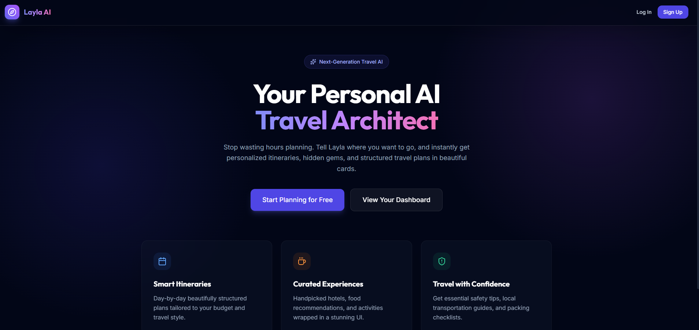
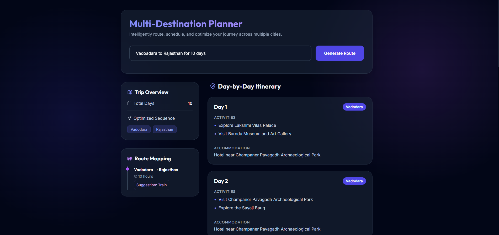
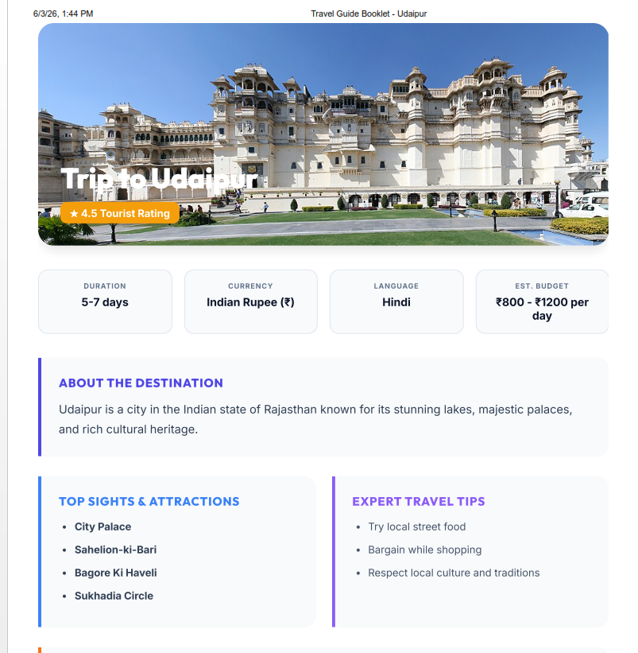

\# Travel Buddy AI Chatbot


\## Overview


Travel Buddy AI Chatbot is an AI-powered travel planning application that helps users generate personalized travel itineraries, explore multiple destinations, receive safety alerts, obtain local transport information, and get packing recommendations.


\## Features


\* User Authentication (JWT + BCrypt)

\* AI-Powered Travel Planning

\* Multi-Destination Trip Planning

\* Route Optimization

\* Local Transport Recommendations

\* Safety Alerts

\* Packing List Generator

\* Travel Favorites Management


\## Tech Stack


\### Frontend


\* ReactJS

\* Vite

\* Tailwind CSS


\### Backend


\* FastAPI

\* REST APIs


\### Database


\* SQLite

\* SQLAlchemy ORM


\### Authentication


\* JWT Authentication

\* BCrypt Password Hashing


\### AI Integration


\* Groq API

\* Llama Model

\* Prompt Engineering


\## Project Screenshots


### Home Page


### Dashboard


### Multi Destination Planning


### Interactive Map


### Download PDF



\## Installation


```bash

git clone <repository-url>

cd Travel-Buddy-Chatbot

pip install -r requirements.txt

```


Run Backend:


```bash

uvicorn main:app --reload

```


Run Frontend:


```bash

cd frontend

npm install

npm run dev

```


